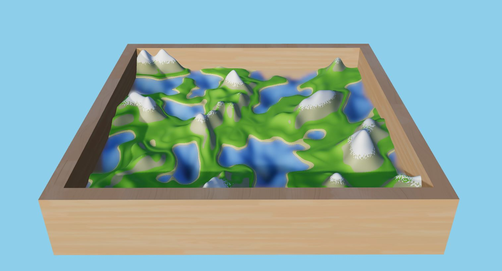

# Procedural Terrain Shader

**Repository for my game Three JS Terrain Shader**

---

## Overview

A Three.js shader for dynamically generating procedural terrain, with customisable fields.

---



--- 

## Setup
Download [Node.js](https://nodejs.org/en/download/).
Run this followed commands:

``` bash
# Install dependencies (only the first time)
npm install

# Run the local server at localhost:8080
npm run dev

# Build for production in the dist/ directory
npm run build
```

## Built With
Three JS 

JavaScript - Scripting & Programming 

## Author
***Jake Rose***

Website: [https://jake-rose.com/](https://jake-rose.com/)
